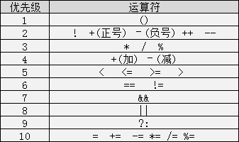
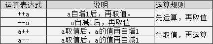

# C语言备忘

## 数据类型

## 运算符

## 运算表达式

## 存储类别

C语言中存储类别又分为四类：自动（auto）、静态（static）、寄存器的（register）和外部的（extern）。

## 数组

1. 数组的下标均以0开始；
2. 数组在初始化的时候，数组内元素的个数不能大于声明的数组长度；
3. 如果采用第一种初始化方式，元素个数小于数组的长度时，多余的数组元素初始化为0；
4. 在声明数组后没有进行初始化的时候，静态（static）和外部（extern）类型的数组元素初始化元素为0，自动（auto）类型的数组的元素初始化值不确定。