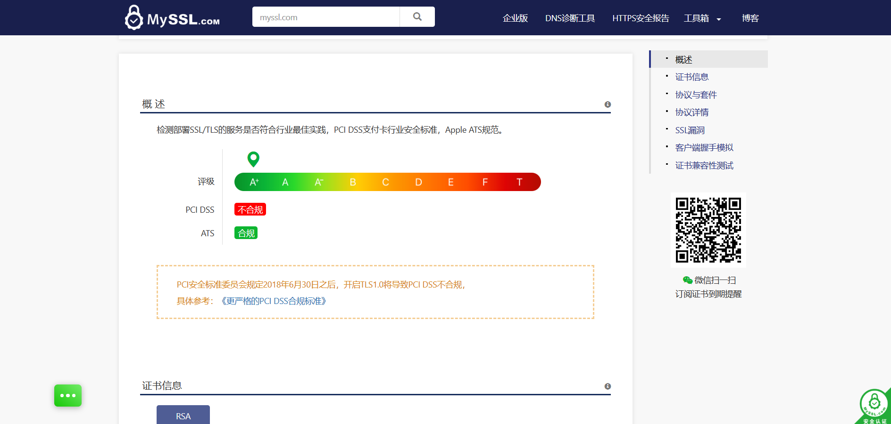
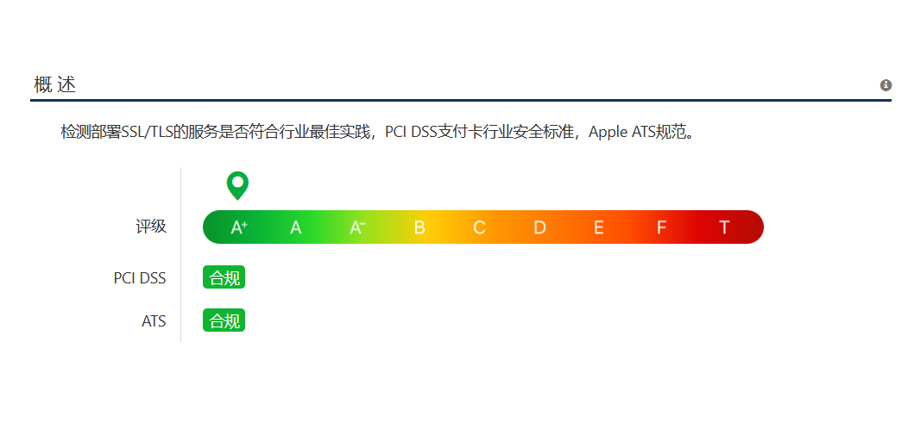

# nginx禁用TLS1.0

在对网站优化的过程中，使用[myssl](https://myssl.com/)检测，发现网站没用禁用TLS1.0



虽然通过开启HSTS达到了A+，但仍然有不合格项，遂开始研究禁用TLS1.0的方法。

关于TLS1.0，你可以看一下这篇文章[又一网络协议被弃用，TLS 1.0及1.1将被TLS 1.2取代。](https://www.trustauth.cn/news/security-news/25018.html)

关于nginx禁用TLS1.0的具体方法，英文好的同学可以去看看这篇文章[Disabling TLS 1.0 on nginx web servers](https://www.cloudibee.com/disabling-tls-1-0-on-nginx/)。

下面是我的禁用方法

连接到服务器，使用cd命令进入`/etc/nginx`下

```shell
cd /etc/nginx
```

使用`ls`查看该目录下的文件，你可以看到有一个名为`nginx.conf`的文件，这就是我们要修改的文件。我们使用vi命令来进行修改。

```shell
vi nginx.conf
```

命令完成后进入编辑界面，找到这样一行:

```
ssl_protocols TLSv1 TLSv1.1 TLSv1.2;
```

将它修改为：

```
ssl_protocols TLSv1.1 TLSv1.2;
```

其实也就是删除`TLSv1`

然后键入`:wq`保存并退出编辑。

之后重启服务器或重启nginx生效。

重启后重新检测，可以发现已经没有不合格项了。



本站的检测报告https://myssl.com/loner1024.top?status=success