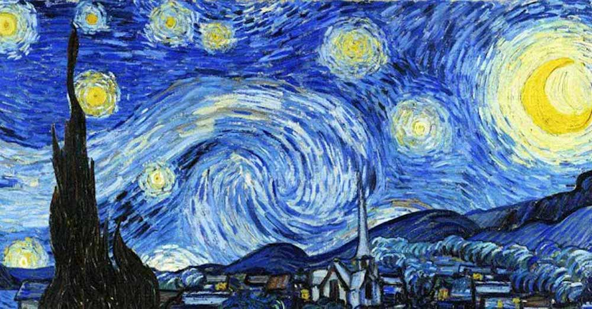
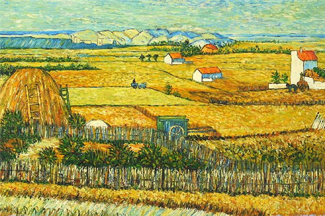
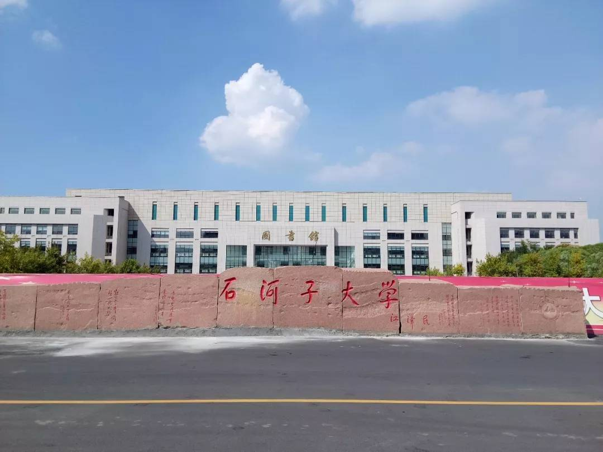

# 图像风格迁移

## 安装包

```python
pip install numpy scipy tensorflow
```

| 包         | 描述              |
| ---------- | ----------------- |
| numpy      | 数值计算 科学计算 |
| scipy      | 同上              |
| tensorflow | 深度学习库        |

再准备一些风格图片和一张内容图片








## 原理

为了将风格图和内容图进行融合，所生成的图片，在内容上应该接近内容图，风格上接近风格图。

因此需要定义**内容损失函数**和**风格损失函数**，经过加权后作为总的损失函数。

步骤如下：

- 随机产生一张图片
- 在每轮迭代中，根据总的损失函数，调整图片像素值
- 经过多轮迭代，得到优化后的图片

## 内容损失函数

CNN具有抽象和理解图像的能力，因此可以考虑将各个卷积层的输出作为图像内容。

这⾥我们使⽤ conv4_2 的输出作为图像的内容表⽰，定义内容损失函数如下。
$$
Lcontent(p⃗,⃗x,l) =
1 2∑ i,j
(Fl ij −Pl ij)
2
$$

## 风格损失函数

