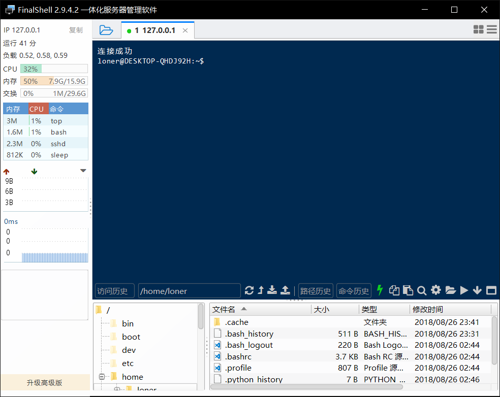

# Ubuntu子系统开启ssh服务

开启ssh服务后可以方便我们进行远程调试和使用更友好的shell工具来连接。

先使用`su`切换到root账户

# 安装ssh

```shell
apt-get install openssh-server
```

可能系统已经安装，可以跳过

## 修改配置文件

进入配置文件所在目录

```shell
cd /etc/ssh/
```

编辑配置文件

```shell
vi sshd_config
```

修改这些内容

```shell
Port 23 #注意不要使用22端口
ListenAddress 127.0.0.1
PasswordAuthentication yes
```

修改完成后保存

然后创建rsa密钥

```shell
sudo ssh-keygen -f /etc/ssh/ssh_host_rsa_key -b 4096 -t rsa
```

然后启动ssh服务

```shell
sudo service ssh — full-restart
```

基本完成。。。

