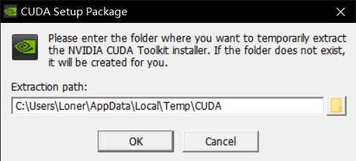
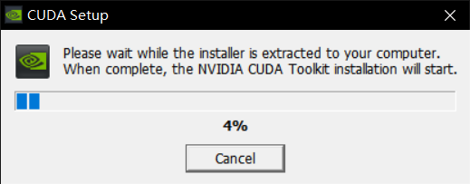
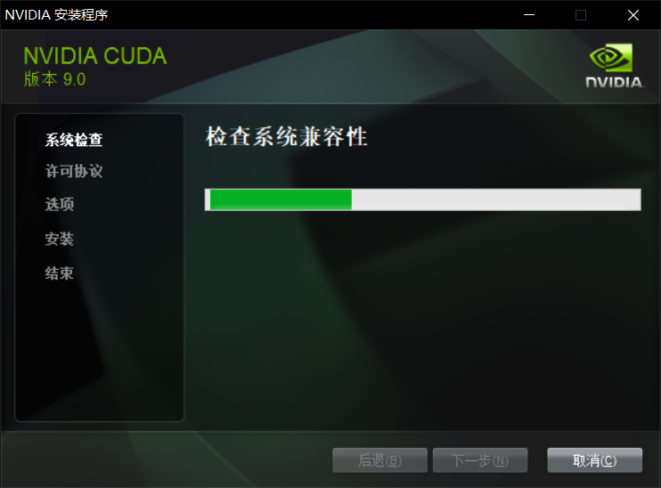
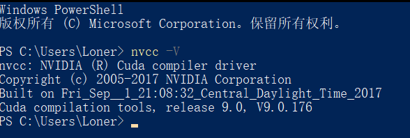
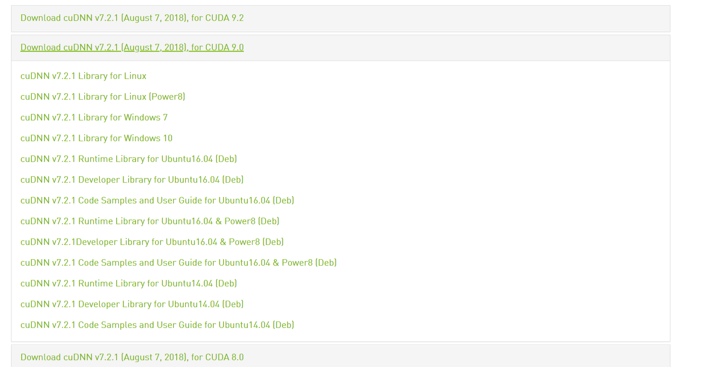
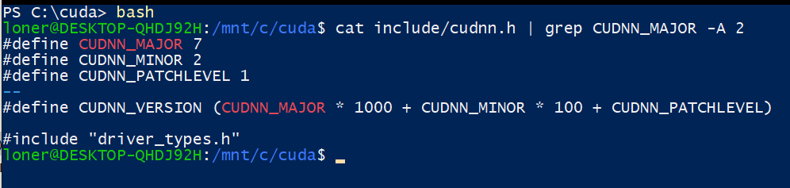
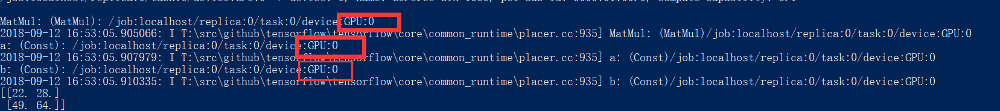

# Windows配置TensorFlow GPU环境

环境如下：

```
Anconda5.2

python3.6

Windows10专业版 64位 1803

i7-6820HK

GTX 1060 6GB
```

先更新一下pip版本

```powershell
python -m pip install --upgrade pip
```

安装tensorglow的gpu版本

```
pip install --upgrade tensorflow-gpu
```

包的体积较大，建议更换pip至国内源后安装，不然太慢

到nvidia网站下载CUDA Toolkit，https://developer.nvidia.com/cuda-toolkit-archive

当然，再次之前你做好到https://developer.nvidia.com/cuda-gpus这里检查一下你的显卡是否支持cuda技术

我下载的是9.0版本，最新的版本是9.2，看网上的说法貌似是9.2目前并不兼容，大家自己尝试一下吧







然后一路next

安装完成后命令行运行

```
nvcc -V
```

进行测试



接着去安装cudnn https://developer.nvidia.com/cudnn


需要注册一个东西，按顺序来就好



选择合适的版本下载

下载完成后解压，打开cudnn的文件夹，然后在这个目录下打开powershell，输入

```
bash
```

然后输入

```
cat include/cudnn.h | grep CUDNN_MAJOR -A 2
```

然后出现类似下图的东西就安装成功了



还需要吧下载下来的cudnn文件中的bin目录加入环境变量，否则报错


然后你可以通过下面的代码来测试是否安装成功

```python
import tensorflow as tf
hello = tf.constant('Hello, TensorFlow!')
sess = tf.Session()
print(sess.run(hello))
```

我第一次运行后出现下面的错误

```
FutureWarning: Conversion of the second argument of issubdtype from `float` to `np.floating` is deprecated. In future, it will be treated as `np.float64 == np.dtype(float).type`.
```

通过更新h5py解决

```
pip install h5py==2.8.0rc1
```

下面的代码可以用来检测tensorflow是否使用gpu开始工作了

```python
# Creates a graph.
a = tf.constant([1.0, 2.0, 3.0, 4.0, 5.0, 6.0], shape=[2, 3], name='a')
b = tf.constant([1.0, 2.0, 3.0, 4.0, 5.0, 6.0], shape=[3, 2], name='b')
c = tf.matmul(a, b)
# Creates a session with log_device_placement set to True.
sess = tf.Session(config=tf.ConfigProto(log_device_placement=True))
# Runs the op.
print(sess.run(c))
```

下图这样就是GPU开始工作了

