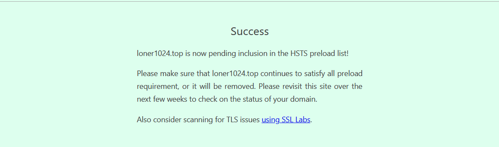

# 网站ssl优化记录

## 配置HSTS

主要参考了[挖站否](https://wzfou.com/)的文章[启用HSTS并加入HSTS Preload List让网站Https访问更加安全-附删除HSTS方法](https://wzfou.com/hsts-preload/)

我采用了php的通用方法，即在`index.php`或`header.php`中添加

```
header("Strict-Transport-Security: max-age=63072000; includeSubdomains; preload");
```

## 加入HSTS Preload List

进入[hstspreload官网](https://hstspreload.org/)，输入域名检测，没有问题后勾选协议提交，然后等待审核。




## 禁用TLS1.0

在使用[myssl](https://myssl.com/)检测的过程中，发现网站没用禁用TLS1.0，具体禁用过程可以参考[nginx禁用TLS1.0](https://loner1024.top/index.php/2018/08/12/24.html)